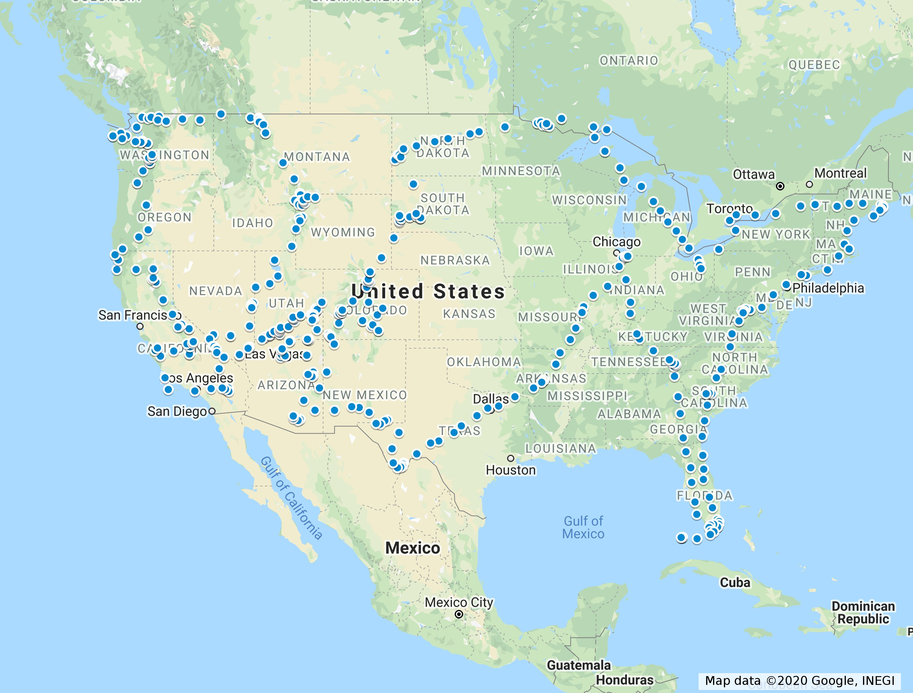
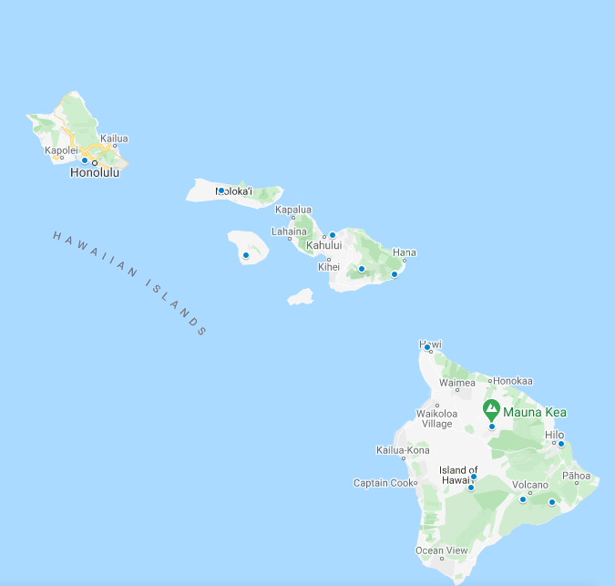
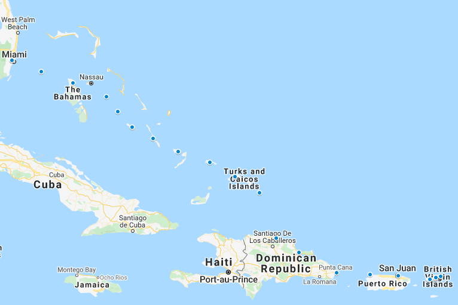

# US National Park Tour in Flight Simulator 2020
A bush flight-style set of flight plans to see all of the US National Parks.

These flights are intended to be similar to FS2020's built-in bush flights, in that they are between 5 and 60 minutes long, averaging around 20-30 minutes, in a Cessna 172-type plane. This allows you to do it in small chunks. The legs that go through the national parks themselves are labeled in the file names, and contain labeled waypoints for various interesting sites in the park. Note that I have not visited most of these parks, and certainly not from the air, so it's possible there may not be much to see at some of the waypoints :)

I suggest using the VL3 for a nice view! I'm open to any suggestions for improvements on these flight plans.

## Lower 48
This is a tour of all of the National Parks in the lower 48 states. It starts and ends in Portland, Oregon.

## Alaska
This starts in Portland, Oregon, and makes its way north through Alaska's 8 national parks. It includes an optional return trip to KPDX, which will require a big plane, like the Airbus.

## Hawaii
This includes flights from KPDX to Honolulu and back, which should definitely be considered optional. Otherwise, the flights go from Honolulu, down through Moloka'i and Lanai, to Haleakala in Maui, and finally the big island.

## America Samoa
This tour takes off from Honolulu and travels down to Pago Pago. You'll need a big plane for that.  Then, it completes a small tour around the islands of American Samoa

## Virgin Islands
This takes off from Miami, winds its way down through the Bahamas, before finally touring the US Virgin Islands. This includes an optional flight back to Miami in a large plane.

Credit to Randal Olson for inspiration on making the road version of this trip. These flight plans were heavily adapted from the plan laid out at http://www.randalolson.com/2016/07/30/the-optimal-u-s-national-parks-centennial-road-trip/
Thanks to www.dirtinmyshoes.com for information on points of interest
